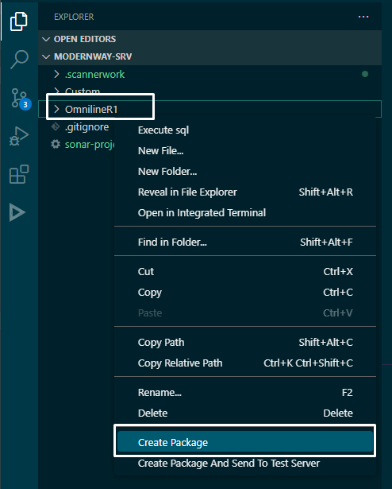
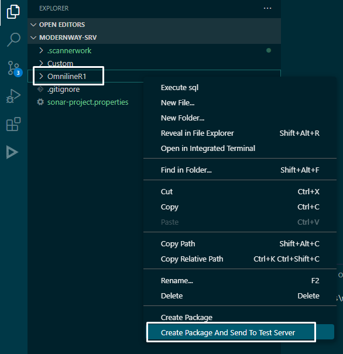

# bpmsoft-creator-package

Расширение позволяет автоматически создавать и устанавливать пакеты с расширением **.gz** на целевой среде.

## Features

#### Create package:

Чтобы сгенерировать пакет, в области **Workspace** Visual Studio Code щелкните правой кнопкой на папке с именем пакета и выберите **Create Package**

Чтобы сгенерировать и отправить пакет на целевую среду, в области **Workspace** Visual Studio Code щелкните правой кнопкой на папке с именем пакета и выберите **Create Package And Send To Test Server**

## Requirements

Для корректной работы необходимо установить **clio** с помощью следующей команды:

`dotnet tool install clio -g`

> Command Line Interface clio is the utility for integration Creatio platform with development and CI/CD tools.

## Extension Settings

Это расширение добавляет следующие настройки:

* `bcp.outputPath`: Specify output full path for .gz file.
* `bcp.remoteTestServerLogin`: Bpmsoft account login for test server.
* `bcp.remoteTestServerPassword`: Bpmsoft account password for test server.

## Known Issues

NONE

## Release Notes

### 1.0.0

Initial release
